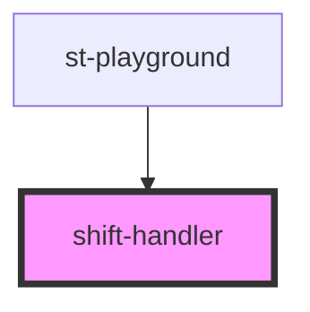

# shift-handler

<!-- Auto Generated Below -->

## Properties

| Property                      | Attribute       | Description | Type                 | Default     |
| ----------------------------- | --------------- | ----------- | -------------------- | ----------- |
| `class`                       | `class`         |             | `string`             | `undefined` |
| `criteria` _(required)_       | `criteria`      |             | `any`                | `undefined` |
| `enter` _(required)_          | `enter`         |             | `string`             | `undefined` |
| `enterReverse`                | `enter-reverse` |             | `string`             | `undefined` |
| `exit` _(required)_           | `exit`          |             | `string`             | `undefined` |
| `exitReverse`                 | `exit-reverse`  |             | `string`             | `undefined` |
| `getChildConfig` _(required)_ | --              |             | `() => CxOrderProps` | `undefined` |
| `getJsx` _(required)_         | --              |             | `() => any`          | `undefined` |
| `stableChild`                 | `stable-child`  |             | `string`             | `undefined` |

## Dependencies

### Used by

 - [st-playground](../st-playground)

### Graph

----------------------------------------------

*Built with [StencilJS](https://stenciljs.com/)*
